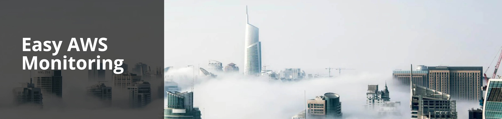

# 📊 AWS Monitoring 🌩️



<div align="center">

**A fully serverless application for monitoring AWS resources and applications for performance, availability, and security issues across multiple AWS accounts.**

</div>

---

## 📖 Table of Contents

<!-- TOC -->
* [📊 AWS Monitoring 🌩️](#-aws-monitoring-)
  * [📖 Table of Contents](#-table-of-contents)
  * [✨ Features](#-features)
  * [🏗️ Project Overview](#-project-overview)
  * [🏁 Getting Started](#-getting-started)
    * [Prerequisites](#prerequisites)
    * [Installation](#installation)
  * [🏃‍♀️ Running the project](#-running-the-project)
    * [Local Development](#local-development)
    * [Deployment](#deployment)
  * [🗃️ Database](#-database)
  * [📚 Documentation](#-documentation)
  * [🤝 Contributing](#-contributing)
<!-- TOC -->

---


---

## ✨ Features

- **Multi-Account Monitoring:** Monitor multiple AWS accounts from a centralized dashboard
- **Real-time Event Processing:** Process CloudWatch events, alarms, and custom monitoring events
- **Automated Error Detection:** Query CloudWatch logs for errors, exceptions, and anomalies
- **Custom Notifications:** Send real-time alerts to Slack and other channels
- **Daily Reports:** Generate comprehensive monitoring reports with summary statistics
- **Hexagonal Architecture:** Clean separation of concerns with ports and adapters pattern
- **Serverless Design:** Built entirely on AWS Lambda and managed services for optimal scalability

---

## 🏗️ Project Overview

This project is a fully serverless application built on AWS using hexagonal architecture (ports and adapters pattern). It provides comprehensive monitoring across multiple AWS accounts with centralized processing and notifications.

### Architecture Highlights

- **Master-Agent Model:** Central monitoring hub with distributed agents
- **Event-Driven Design:** Uses EventBridge for decoupled communication between stacks
- **Single-Table DynamoDB:** Optimized storage for events and agent data
- **Hexagonal Architecture:** Clean separation between business logic and external dependencies
- **Multi-Environment Support:** Dev, staging, and production configurations

### Core Components

- **Master Stack:** Central event processing, notifications, and API services
- **Agent Stack:** Distributed log querying and event publishing
- **Lambda Functions:** HandleMonitoringEvents, DailyReport, UpdateDeployment, QueryErrorLogs
- **API Gateway:** REST endpoints for agent and event management
- **DynamoDB:** Single-table design for efficient data storage

For detailed technical documentation, see [**System Architecture**](docs/system_architecture.md) and [**Code Standards**](docs/code-standards.md).

---

## 🏁 Getting Started

### Prerequisites

- [Python 3.13](https://www.python.org/downloads/)
- [NodeJs 23.0.0](https://nodejs.org/en/download/)
- [Docker](https://docs.docker.com/engine/install/)
- [AWS CLI](https://docs.aws.amazon.com/cli/latest/userguide/getting-started-install.html)
- [AWS Account](https://aws.amazon.com/) with appropriate permissions

### Installation

1. **Clone the repository:**

   ```bash
   git clone https://github.com/anhlt59/aws-monitoring.git
   cd aws-monitoring
   ```

2. **Install dependencies:**

   ```bash
   make install
   ```

3. **Configure environment variables:**

   ```bash
   cp .claude/.env.example .claude/.env
   # Edit .claude/.env with your configuration
   ```

---

## 🏃‍♀️ Running the project

### Local Development

For detailed instructions on how to run the project locally, please see the [**Local Development Guide**](docs/development.md).

### Deployment

For detailed instructions on how to deploy the project to your AWS account, please see the [**Deployment Guide**](docs/deployment.md).

---

## 🗃️ Database

The project uses Amazon DynamoDB as its database. For more information about the database schema, please see the [**Database Schema Documentation**](docs/db.md).

---

## 📚 Documentation

| Document | Description |
|----------|-------------|
| [Project Overview](docs/project-overview-pdr.md) | Comprehensive project overview and product development requirements |
| [Codebase Summary](docs/codebase-summary.md) | Layer structure, key components, and code organization |
| [System Architecture](docs/system-architecture.md) | High-level architecture and component interactions |
| [Code Standards](docs/code-standards.md) | Coding conventions and architecture patterns |
| [Project Roadmap](docs/project-roadmap.md) | Current status and planned features |
| [Database Schema](docs/db.md) | DynamoDB table structure and access patterns |
| [Infrastructure](docs/infrastructure.md) | Serverless Framework configuration and deployment |
| [Local Development](docs/development.md) | Local setup and development workflow |

---

## 🤝 Contributing

Contributions are welcome! Please see the [**Contributing Guide**](docs/git/contributing.md) for more information.
