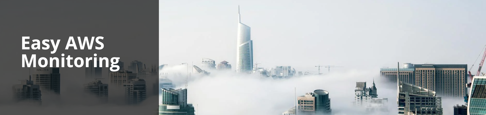
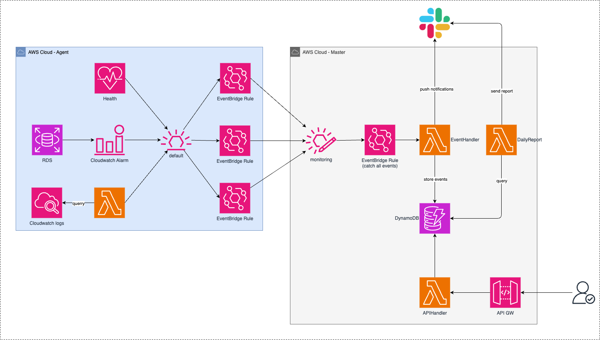

# 📊 AWS Monitoring 🌩️

🔹 Architecture: Fully serverless (AWS Lambda, API Gateway, DynamoDB, EventBridge, SNS, S3, CloudWatch) 
🔹 Purpose: Monitors AWS resources and applications for performance, availability, and security issues. 

<!-- TOC -->
* [📊 AWS Monitoring 🌩️](#-aws-monitoring-)
  * [💻 Tech Stack](#-tech-stack)
  * [🧪 Testing](#-testing)
  * [🏗️ Infrastructure](#-infrastructure)
  * [📦 Framework](#-framework)
  * [🛠️ Development](#-development)
  * [🚀 Deployment](#-deployment)
  * [🤝 Contributing](#-contributing)
<!-- TOC -->

## 💻 Tech Stack

## 🧪 [Testing](tests)

## 🏗️ Infrastructure

## 📦 Framework

This application is constructed using the Serverless Framework.

- [Serverless Framework](https://www.serverless.com/)

## 🛠️ Development

- [Development](docs/development.md)
- [Folder Structure](docs/folder_structure.md)
- [Database](docs/db.md)
- [API GW](docs/aws-api-gw.md)
- Lambda Functions:
  - [Master-HandleMonitoringEvent](infra/master/functions/HandleMonitoringEvents.yml)
  - [Master-DailyReport](infra/master/functions/DailyReport.yml)
  - [Master-GetEvent](infra/master/functions/api/GetEvent.yml)
  - [Master-ListEvent](infra/master/functions/api/ListEvents.yml)
  - [Master-UpdateEvent](infra/master/functions/api/UpdateEvent.yml)
  - [Agent-DailyReport](infra/agent/functions/QueryErrorLogs.yml)

## 🚀 Deployment

- AWS
  - [Prerequisite Resources](docs/aws-prerequisite-resources.md)
  - [Environment Configs](docs/aws-environment-configs.md)
  - [Deployment](docs/aws-deployment.md)

## 🤝 [Contributing](docs/git/contributing.md)
