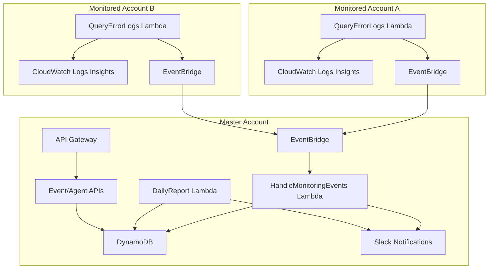

# Project Overview

## Architecture

The AWS Monitoring project is a fully serverless multi-account monitoring solution designed to provide comprehensive
visibility into AWS resources, applications, and infrastructure across multiple AWS accounts with centralized monitoring
and alerting.


## System Design

### Master-Agent Architecture

This system follows a **hub-and-spoke model** where:

- **Master Stack (Hub):** Central monitoring system deployed once per organization
- **Agent Stacks (Spokes):** Lightweight monitoring agents deployed in each monitored AWS account

### Data Flow



## Components Deep Dive

### Master Stack

**Purpose:** Central monitoring hub that processes, stores, and acts on monitoring events from all connected accounts.

#### Core Functions:

- **Event Processing:** Handles incoming monitoring events from agent stacks
- **Data Storage:** Persists events and agent status in DynamoDB with optimized access patterns
- **Notifications:** Sends real-time Slack notifications for critical events
- **Reporting:** Generates daily/weekly monitoring reports
- **API Services:** Provides REST APIs for event and agent management

#### Key Lambda Functions:

| Function                 | Trigger                | Purpose                                      |
|--------------------------|------------------------|----------------------------------------------|
| `HandleMonitoringEvents` | EventBridge            | Process and store incoming monitoring events |
| `DailyReport`            | EventBridge (Schedule) | Generate daily monitoring summaries          |
| `UpdateDeployment`       | EventBridge            | Manage agent deployment lifecycle            |

#### Infrastructure:

- **DynamoDB Table:** Single-table design with events and agents
- **EventBridge Custom Bus:** Receives events from all monitored accounts
- **API Gateway:** REST endpoints for programmatic access
- **SQS Dead Letter Queue:** Error handling for failed event processing

### Agent Stack

**Purpose:** Lightweight monitoring probes deployed in each monitored AWS account to detect and report issues.

#### Core Functions:

- **Log Analysis:** Query CloudWatch Logs for errors, exceptions, and anomalies
- **Event Publishing:** Send structured monitoring events to master stack
- **Resource Discovery:** Identify Lambda functions, ECS services, and other resources to monitor
- **Health Checks:** Periodic validation of monitored services

#### Key Lambda Functions:

| Function         | Trigger                | Purpose                                              |
|------------------|------------------------|------------------------------------------------------|
| `QueryErrorLogs` | EventBridge (Schedule) | Search CloudWatch Logs for errors and publish events |

#### Configuration:

```yaml
# Environment Variables
CW_INSIGHTS_QUERY_STRING: "fields @message | filter @message like /(?i)(error|fail|exception)/"
CW_INSIGHTS_QUERY_DURATION: 300  # seconds
CW_LOGS_DELIVERY_LATENCY: 15     # seconds
CW_LOG_GROUPS_CHUNK_SIZE: 10     # groups per query
```

## Hexagonal Architecture

The codebase implements hexagonal (ports and adapters) architecture:

### Layers:

1. **Entrypoints (Presentation Layer)**
  - Lambda handlers serving as application entry points
  - Minimal logic, primarily input validation and response formatting
  - Located in `src/entrypoints/`

2. **Domain Layer**
  - Business logic and use cases
  - Domain models and entities
  - Pure business rules without external dependencies
  - Located in `src/domain/`

3. **Adapters (Infrastructure Layer)**
  - External service integrations (AWS services, databases, APIs)
  - Repository implementations
  - Notification services
  - Located in `src/adapters/`

4. **Common Layer**
  - Shared utilities, configuration, logging
  - Cross-cutting concerns
  - Located in `src/common/`

### Dependency Injection

Uses `dependency-injector` library for IoC:

- Services are injected into handlers
- Repositories are injected into use cases
- External dependencies are mocked for testing

## Event-Driven Design

### Event Types

The system processes various event types:

| Event Type            | Source                 | Severity | Action                                 |
|-----------------------|------------------------|----------|----------------------------------------|
| `CloudWatch Alarm`    | aws.cloudwatch         | High     | Real-time Slack notification           |
| `Error Log Detection` | Custom (Logs Insights) | Medium   | Aggregated in daily report             |
| `Lambda Error`        | aws.lambda             | High     | Real-time notification + investigation |
| `ECS Task Failure`    | aws.ecs                | Medium   | Notification with context              |

### Event Processing Pipeline

1. **Collection:** Agent stacks query CloudWatch Logs every 5 minutes
2. **Transformation:** Raw logs converted to structured events
3. **Routing:** Events published to master stack via EventBridge
4. **Processing:** Master stack validates, enriches, and stores events
5. **Notification:** Critical events trigger immediate Slack notifications
6. **Reporting:** All events included in daily/weekly reports

## Tech Stack

### Backend Framework

- **Python 3.13** - Primary language with modern features
- **Pydantic 2.x** - Data validation and serialization
- **AWS Lambda Powertools** - Observability and utilities
- **PynamoDB** - DynamoDB ORM with type safety

### Infrastructure

- **AWS Lambda** - Serverless compute with Python 3.13 runtime
- **DynamoDB** - NoSQL database with single-table design
- **EventBridge** - Event routing and cross-account communication
- **CloudWatch Logs Insights** - Log querying and analysis
- **API Gateway** - REST API with Lambda proxy integration
- **Serverless Framework 4.x** - Infrastructure as Code

### Development Tooling

- **Poetry** - Python dependency management with lock files
- **Pytest** - Testing with fixtures and parametrization
- **LocalStack** - Local AWS service emulation
- **Pre-commit** - Git hooks for code quality
- **Ruff** - Fast Python linter and formatter
- **Docker** - Containerized development environment

## Monitoring & Observability

### Logging Strategy

- **Structured Logging:** JSON format with correlation IDs
- **Log Levels:** DEBUG for development, INFO for production
- **Context Injection:** Lambda context automatically included
- **Error Tracking:** Exceptions captured with full stack traces

### Metrics Collection

- **Lambda Insights:** Automatic performance monitoring
- **Custom Metrics:** Event processing rates, error counts
- **DynamoDB Metrics:** Read/write capacity, throttling
- **API Gateway Metrics:** Request latency, error rates

### Alerting Thresholds

```yaml
Critical: Lambda errors > 5% in 5 minutes
High: DynamoDB throttling detected
Medium: Event processing latency > 30s
Low: Daily report generation failure
```

## Security Considerations

### IAM Principles

- **Least Privilege:** Functions have minimal required permissions
- **Cross-Account Roles:** Secure EventBridge access between accounts
- **Resource-Based Policies:** Fine-grained DynamoDB and EventBridge access

### Data Protection

- **Encryption at Rest:** DynamoDB tables encrypted with AWS KMS
- **Encryption in Transit:** All API calls use HTTPS/TLS 1.2+
- **Sensitive Data:** Webhook URLs stored in environment variables
- **Log Sanitization:** PII automatically redacted from logs

### Network Security

- **VPC Optional:** Functions can run in VPC for additional isolation
- **Security Groups:** Restrictive ingress/egress rules when VPC-enabled
- **Private Endpoints:** VPC endpoints for AWS service access
