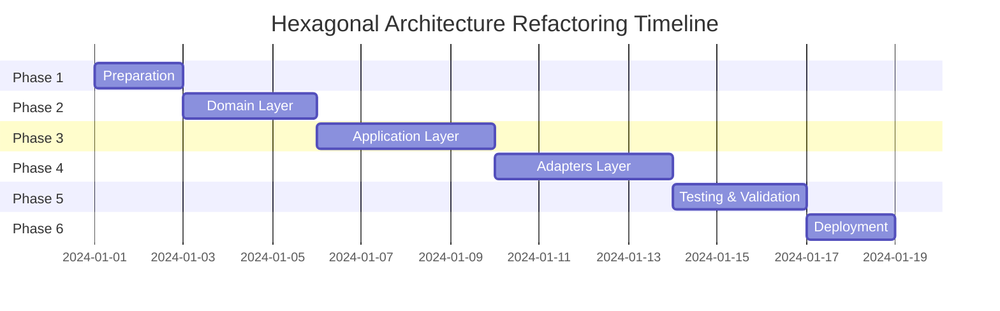

# Plan Refactor theo Hexagonal Architecture

## 📋 Tổng Quan

Plan này nhằm refactor toàn bộ codebase trong thư mục `src/` để tuân thủ kiến trúc Hexagonal (Ports and Adapters), tách biệt rõ ràng business logic khỏi infrastructure concerns.

## 🎯 Mục Tiêu

1. **Tách biệt Domain Logic**: Core business logic không phụ thuộc vào bất kỳ framework/library nào
2. **Dependency Inversion**: Application layer chỉ phụ thuộc vào interfaces (ports), không phụ thuộc concrete implementations
3. **Testability**: Dễ dàng unit test domain và application logic mà không cần mock AWS services
4. **Maintainability**: Code dễ bảo trì và mở rộng hơn
5. **Flexibility**: Dễ dàng thay thế infrastructure components

## 🏗️ Cấu Trúc Hiện Tại

```
src/
├── common/           # Shared utilities, configs
├── entrypoints/      # Lambda handlers, API handlers (tương đối tốt)
├── infra/           # AWS services, DB (đã tách biệt khá tốt)
├── modules/         # Business logic (cần refactor)
    ├── agent/
    └── master/
```

### Vấn Đề Cần Giải Quyết

1. **modules/** chứa cả domain models và services - cần tách biệt rõ hơn
2. Services trong modules có thể trực tiếp phụ thuộc vào infrastructure
3. Chưa có ports (interfaces) rõ ràng cho domain layer
4. Business logic chưa hoàn toàn độc lập

## 🎨 Kiến Trúc Đề Xuất

### Nguyên Tắc Phân Lớp

```
┌──────────────────────────────────────────────┐
│           ADAPTERS (PRIMARY)                 │
│  Lambda Handlers | API Gateway | CLI         │
├──────────────────────────────────────────────┤
│           APPLICATION LAYER                  │
│         Use Cases | Orchestration            │
├──────────────────────────────────────────────┤
│            DOMAIN LAYER                      │
│    Entities | Value Objects | Ports          │
├──────────────────────────────────────────────┤
│          ADAPTERS (SECONDARY)                │
│  DynamoDB | AWS Services | Notifications     │
└──────────────────────────────────────────────┘
```

### Cấu Trúc Thư Mục Mới

```
src/
├── domain/                 # Core business logic (không phụ thuộc)
│   ├── agent/
│   │   ├── entities/      # Domain entities
│   │   ├── value_objects/ # Value objects
│   │   ├── events/        # Domain events
│   │   └── ports/         # Interface definitions
│   └── master/
│       ├── entities/
│       ├── value_objects/
│       ├── events/
│       └── ports/
│
├── application/           # Use cases & orchestration
│   ├── agent/
│   │   ├── use_cases/    # Business use cases
│   │   └── services/     # Application services
│   └── master/
│       ├── use_cases/
│       └── services/
│
├── adapters/             # All external integrations
│   ├── primary/         # Driving adapters (entry points)
│   │   ├── lambda/     # Lambda handlers
│   │   ├── api/        # API Gateway handlers
│   │   └── cli/        # CLI interfaces (if any)
│   │
│   └── secondary/      # Driven adapters (implementations)
│       ├── persistence/
│       │   ├── dynamodb/
│       │   └── mappers/
│       ├── aws/
│       │   ├── cloudwatch/
│       │   ├── eventbridge/
│       │   ├── ecs/
│       │   └── lambda/
│       └── notifications/
│           ├── slack/
│           └── email/
│
└── common/             # Shared utilities (giữ nguyên)
    ├── constants.py
    ├── exceptions.py
    ├── logger.py
    └── utils/
```

## 📝 Chi Tiết Từng Layer

### 1. Domain Layer

**Đặc điểm:**
- Không phụ thuộc vào bất kỳ layer nào khác
- Chứa pure business logic
- Định nghĩa ports (interfaces) cho external dependencies

**Components:**

```python
# domain/master/entities/event.py
from dataclasses import dataclass
from datetime import datetime
from enum import IntEnum

class Severity(IntEnum):
    UNKNOWN = 0
    LOW = 1
    MEDIUM = 2
    HIGH = 3
    CRITICAL = 4

@dataclass
class MonitoringEvent:
    id: str
    account: str
    region: str
    source: str
    detail: dict
    detail_type: str
    severity: Severity
    resources: list[str]
    published_at: datetime

    def is_critical(self) -> bool:
        return self.severity >= Severity.HIGH

    def requires_immediate_action(self) -> bool:
        return self.severity == Severity.CRITICAL

# domain/master/ports/event_repository.py
from typing import Protocol, Optional, List
from datetime import datetime
from ..entities.event import MonitoringEvent

class EventRepository(Protocol):
    async def save(self, event: MonitoringEvent) -> None:
        """Save an event to the repository"""
        ...

    async def find_by_id(self, event_id: str) -> Optional[MonitoringEvent]:
        """Find an event by its ID"""
        ...

    async def find_by_time_range(
        self,
        start_time: datetime,
        end_time: datetime
    ) -> List[MonitoringEvent]:
        """Find events within a time range"""
        ...

# domain/master/ports/notifier.py
from typing import Protocol
from ..entities.event import MonitoringEvent

class Notifier(Protocol):
    async def notify(self, event: MonitoringEvent) -> None:
        """Send notification for an event"""
        ...
```

### 2. Application Layer

**Đặc điểm:**
- Orchestrates domain logic
- Implements use cases
- Depends on domain ports, not implementations

**Components:**

```python
# application/master/use_cases/handle_monitoring_event.py
from domain.master.ports.event_repository import EventRepository
from domain.master.ports.notifier import Notifier
from domain.master.entities.event import MonitoringEvent

class HandleMonitoringEventUseCase:
    def __init__(
        self,
        event_repository: EventRepository,
        notifier: Notifier
    ):
        self.event_repository = event_repository
        self.notifier = notifier

    async def execute(self, event_data: dict) -> None:
        # Convert raw data to domain entity
        event = MonitoringEvent.from_dict(event_data)

        # Business logic
        await self.event_repository.save(event)

        if event.is_critical():
            await self.notifier.notify(event)

        # Additional business rules
        if event.requires_immediate_action():
            await self._trigger_emergency_protocol(event)

    async def _trigger_emergency_protocol(self, event: MonitoringEvent):
        # Complex business logic here
        pass
```

### 3. Adapters Layer

#### Primary Adapters (Entry Points)

```python
# adapters/primary/lambda/handle_monitoring_events.py
import json
from adapters.secondary.persistence.dynamodb.event_repository import DynamoDBEventRepository
from adapters.secondary.notifications.slack.notifier import SlackNotifier
from application.master.use_cases.handle_monitoring_event import HandleMonitoringEventUseCase
from common.logger import Logger

logger = Logger(__name__)

def handler(event: dict, context: dict) -> dict:
    """AWS Lambda handler"""
    try:
        # Dependency injection
        event_repository = DynamoDBEventRepository()
        notifier = SlackNotifier()

        # Create use case with injected dependencies
        use_case = HandleMonitoringEventUseCase(
            event_repository=event_repository,
            notifier=notifier
        )

        # Process each record
        for record in event.get('Records', []):
            event_data = json.loads(record['body'])
            await use_case.execute(event_data)

        return {
            'statusCode': 200,
            'body': json.dumps({'status': 'success'})
        }
    except Exception as e:
        logger.error(f"Error processing event: {e}")
        return {
            'statusCode': 500,
            'body': json.dumps({'error': str(e)})
        }
```

#### Secondary Adapters (Implementations)

```python
# adapters/secondary/persistence/dynamodb/event_repository.py
import boto3
from typing import Optional, List
from datetime import datetime
from domain.master.ports.event_repository import EventRepository
from domain.master.entities.event import MonitoringEvent
from .mappers.event_mapper import EventMapper

class DynamoDBEventRepository(EventRepository):
    def __init__(self):
        self.dynamodb = boto3.resource('dynamodb')
        self.table = self.dynamodb.Table('MonitoringEvents')
        self.mapper = EventMapper()

    async def save(self, event: MonitoringEvent) -> None:
        item = self.mapper.to_dynamodb_item(event)
        self.table.put_item(Item=item)

    async def find_by_id(self, event_id: str) -> Optional[MonitoringEvent]:
        response = self.table.get_item(
            Key={'pk': 'EVENT', 'sk': f'EVENT#{event_id}'}
        )
        if 'Item' in response:
            return self.mapper.to_domain_entity(response['Item'])
        return None

    async def find_by_time_range(
        self,
        start_time: datetime,
        end_time: datetime
    ) -> List[MonitoringEvent]:
        response = self.table.query(
            KeyConditionExpression='pk = :pk AND sk BETWEEN :start AND :end',
            ExpressionAttributeValues={
                ':pk': 'EVENT',
                ':start': f'EVENT#{start_time.isoformat()}',
                ':end': f'EVENT#{end_time.isoformat()}'
            }
        )
        return [
            self.mapper.to_domain_entity(item)
            for item in response.get('Items', [])
        ]
```

## 🚀 Kế Hoạch Thực Hiện

### Phase 1: Chuẩn Bị (1-2 ngày)

1. **Tạo cấu trúc thư mục mới**
   - [ ] Tạo domain/, application/, adapters/
   - [ ] Thiết lập __init__.py files

2. **Xác định và tạo Domain Entities**
   - [ ] Event entity
   - [ ] Agent entity
   - [ ] Value objects (Severity, Status, etc.)

3. **Định nghĩa Ports**
   - [ ] EventRepository interface
   - [ ] AgentRepository interface
   - [ ] Notifier interface
   - [ ] EventPublisher interface

### Phase 2: Migration Domain Layer (2-3 ngày)

1. **Di chuyển Domain Models**
   - [ ] Refactor models từ modules/*/models/
   - [ ] Loại bỏ infrastructure dependencies
   - [ ] Thêm business logic vào entities

2. **Tạo Domain Services (nếu cần)**
   - [ ] Services chứa complex business logic
   - [ ] Không phụ thuộc external systems

### Phase 3: Migration Application Layer (3-4 ngày)

1. **Tạo Use Cases**
   - [ ] HandleMonitoringEventUseCase
   - [ ] QueryErrorLogsUseCase
   - [ ] GenerateDailyReportUseCase
   - [ ] UpdateDeploymentUseCase

2. **Refactor Services**
   - [ ] Di chuyển từ modules/*/services/
   - [ ] Implement dependency injection
   - [ ] Sử dụng ports thay vì concrete implementations

### Phase 4: Migration Adapters (3-4 ngày)

1. **Primary Adapters**
   - [ ] Refactor Lambda handlers
   - [ ] Refactor API Gateway handlers
   - [ ] Setup dependency injection container

2. **Secondary Adapters**
   - [ ] Implement DynamoDB repositories
   - [ ] Implement AWS service adapters
   - [ ] Implement notification adapters

### Phase 5: Testing & Validation (2-3 ngày)

1. **Unit Tests**
   - [ ] Domain layer tests (100% coverage)
   - [ ] Application layer tests với mock ports
   - [ ] Adapter integration tests

2. **Integration Tests**
   - [ ] End-to-end flow tests
   - [ ] LocalStack integration tests

3. **Performance Tests**
   - [ ] Benchmark critical paths
   - [ ] Memory usage analysis

### Phase 6: Deployment & Migration (1-2 ngày)

1. **Gradual Migration**
   - [ ] Deploy to dev environment
   - [ ] Run parallel với old code
   - [ ] Monitor và compare results

2. **Documentation**
   - [ ] Update architecture docs
   - [ ] Update deployment guides
   - [ ] Team training materials

## 🔧 Công Cụ Hỗ Trợ

### Dependency Injection Container

```python
# adapters/container.py
from typing import Dict, Any, Callable

class DIContainer:
    def __init__(self):
        self._services: Dict[str, Callable] = {}
        self._singletons: Dict[str, Any] = {}

    def register(self, name: str, factory: Callable, singleton: bool = False):
        self._services[name] = (factory, singleton)

    def resolve(self, name: str):
        if name not in self._services:
            raise ValueError(f"Service {name} not registered")

        factory, is_singleton = self._services[name]

        if is_singleton:
            if name not in self._singletons:
                self._singletons[name] = factory()
            return self._singletons[name]

        return factory()

# Usage in Lambda handler
container = DIContainer()
container.register('event_repository',
                  lambda: DynamoDBEventRepository(),
                  singleton=True)
container.register('notifier',
                  lambda: SlackNotifier(),
                  singleton=True)
container.register('handle_event_use_case',
                  lambda: HandleMonitoringEventUseCase(
                      container.resolve('event_repository'),
                      container.resolve('notifier')
                  ))
```

## 📊 Metrics & KPIs

### Chỉ Số Thành Công

1. **Code Quality**
   - Test coverage > 80%
   - Cyclomatic complexity < 10
   - Zero circular dependencies

2. **Performance**
   - Lambda cold start < 1s
   - Response time < 200ms (P95)
   - Memory usage < 256MB

3. **Maintainability**
   - Deployment time < 5 minutes
   - Time to add new feature reduced by 30%
   - Bug fix time reduced by 40%

## ⚠️ Rủi Ro & Mitigation

| Rủi Ro | Probability | Impact | Mitigation Strategy |
|--------|------------|---------|-------------------|
| Breaking changes | High | High | Gradual migration, feature flags |
| Performance degradation | Medium | High | Benchmark before/after, optimize hot paths |
| Team resistance | Low | Medium | Training sessions, pair programming |
| Increased complexity | Medium | Medium | Clear documentation, examples |
| Deployment issues | Low | High | Blue-green deployment, rollback plan |

## 📅 Timeline



## ✅ Checklist Tổng Quan

- [ ] Domain layer hoàn toàn độc lập
- [ ] Tất cả dependencies đều thông qua interfaces
- [ ] Unit tests cover > 80%
- [ ] Integration tests pass 100%
- [ ] Performance benchmarks đạt yêu cầu
- [ ] Documentation đầy đủ
- [ ] Team được training
- [ ] Deployment scripts updated
- [ ] Monitoring & alerting configured
- [ ] Rollback plan tested

## 🎯 Next Steps

1. Review và approve plan với team
2. Setup feature branches
3. Bắt đầu Phase 1: Preparation
4. Daily standup để track progress
5. Weekly review với stakeholders

---

**Note**: Plan này có thể điều chỉnh dựa trên feedback và thực tế triển khai. Mục tiêu chính là tạo ra một codebase maintainable, testable và scalable.