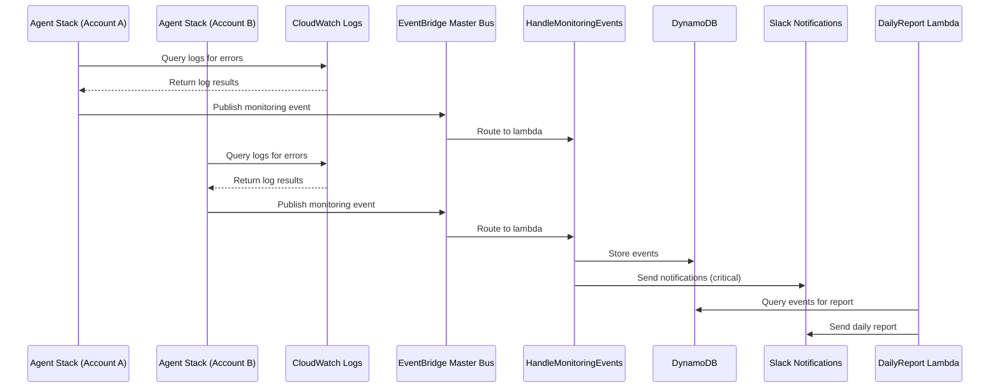

# System Architecture

## 🏗️ High-Level Architecture

The AWS Monitoring System is designed as a **fully serverless, multi-account monitoring solution** built on hexagonal architecture principles. It provides centralized visibility into AWS resources and applications across multiple accounts with real-time processing, automated detection, and intelligent notifications.

### Architecture Overview

```
┌─────────────────────────────────────────────────────────────────────────────┐
│                             AWS Cloud Environment                           │
│                                                                             │
│    ┌─────────────────┐    ┌─────────────────┐    ┌─────────────────┐         │
│    │   Account A     │    │   Account B     │    │   Account C     │         │
│    │                 │    │                 │    │                 │         │
│    │ ┌─────────────┐ │    │ ┌─────────────┐ │    │ ┌─────────────┐ │         │
│    │ │QueryErrorLogs│ │    │ │QueryErrorLogs│ │    │ │QueryErrorLogs│ │         │
│    │ │ (Agent LAMBDA)│ │    │ │ (Agent LAMBDA)│ │    │ │ (Agent LAMBDA)│ │         │
│    │ └─────────────┘ │    │ └─────────────┘ │    │ └─────────────┘ │         │
│    │                 │    │                 │    │                 │         │
│    │ ┌─────────────┐ │    │ ┌─────────────┐ │    │ ┌─────────────┐ │         │
│    │ │CloudWatch   │ │    │ │CloudWatch   │ │    │ │CloudWatch   │ │         │
│    │ │Logs         │ │    │ │Logs         │ │    │ │Logs         │ │         │
│    │ └─────────────┘ │    │ └─────────────┘ │    │ └─────────────┘ │         │
│    │                 │    │                 │    │                 │         │
│    │ ┌─────────────┐ │    │ ┌─────────────┐ │    │ ┌─────────────┐ │         │
│    │ │EventBridge  │ │    │ │EventBridge  │ │    │ │EventBridge  │ │         │
│    │ │(Local Rules) │ │    │ │(Local Rules) │ │    │ │(Local Rules) │ │         │
│    │ └─────────────┘ │    │ └─────────────┘ │    │ └─────────────┘ │         │
│    └─────────────────┘    └─────────────────┘    └─────────────────┘         │
│             │                       │                       │               │
│             └───────────┬───────────┴───────────┬───────────┘               │
│                         │                       │                           │
│                         ▼                       ▼                           │
│          ┌─────────────────────────────────────────────────────────────────┐   │
│          │                     MASTER ACCOUNT                          │   │
│          │                                                                 │   │
│          │ ┌─────────────────────────────────────────────────────────┐   │   │
│          │ │                EventBridge Bus                        │   │   │
│          │ │    monitoring-master-{stage}-MonitoringEventBus      │   │   │
│          │ │            (Cross-Account Event Bus)                  │   │   │
│          │ └─────────────────────────────────────────────────────────┘   │   │
│          │                                                                 │   │
│          │ ┌─────────────────────────────────────────────────────────┐   │   │
│          │ │                   DynamoDB                             │   │   │
│          │ │                 Single-Table Design                    │   │   │
│          │ │        Events & Agents Storage with TTL                │   │   │
│          │ └─────────────────────────────────────────────────────────┘   │   │
│          │                                                                 │   │
│          │ ┌─────────────────────────────────────────────────────────┐   │   │
│          │ │                   API Gateway                          │   │   │
│          │ │                  REST APIs                             │   │   │
│          │ │            /agents, /events endpoints                 │   │   │
│          │ └─────────────────────────────────────────────────────────┘   │   │
│          │                                                                 │   │
│          │ ┌─────────────────────────────────────────────────────────┐   │   │
│          │ │                  Lambda Functions                       │   │   │
│          │ │  ┌─────────────┐  ┌─────────────┐  ┌─────────────┐    │   │   │
│          │ │  │HandleMgmtEvs│  │DailyReport  │  │UpdateDeploy │    │   │   │
│          │ │  │  LAMBDA    │  │  LAMBDA     │  │   LAMBDA    │    │   │   │
│          │ │  └─────────────┘  └─────────────┘  └─────────────┘    │   │   │
│          │ └─────────────────────────────────────────────────────────┘   │   │
│          │                                                                 │   │
│          │ ┌─────────────────────────────────────────────────────────┐   │   │
│          │ │                  Notification Services                  │   │   │
│          │ │                  (Slack, Email)                         │   │   │
│          │ └─────────────────────────────────────────────────────────┘   │   │
│          │                                                                 │   │
│          │ ┌─────────────────────────────────────────────────────────┐   │   │
│          │ │                  SQS Dead Letter Queue                   │   │   │
│          │ │              Error Handling & Retry                     │   │   │
│          │ └─────────────────────────────────────────────────────────┘   │   │
│          └─────────────────────────────────────────────────────────────────┘   │
└─────────────────────────────────────────────────────────────────────────────┘
```

## 🔧 Component Interactions

### Master-Agent Communication Flow



### Data Flow Architecture

#### Event Processing Pipeline

1. **Log Collection** (Agent Stacks)
   - Schedule CloudWatch Logs queries every 5 minutes
   - Query for error patterns using predefined queries
   - Transform raw logs into structured events

2. **Event Publishing** (Agent Stacks)
   - Format events with metadata (account, region, timestamp)
   - Publish to master EventBridge bus via cross-account access
   - Handle publishing failures with retry logic

3. **Event Processing** (Master Stack)
   - Receive and validate incoming events
   - Enrich events with additional context
   - Store events in DynamoDB with TTL
   - Trigger notifications for critical events
   - Route to appropriate handlers based on event type

4. **Notification Generation** (Master Stack)
   - Real-time Slack notifications for critical events
   - Daily aggregation reports with summary statistics
   - Configurable notification channels and thresholds

5. **Data Access** (API Gateway)
   - REST endpoints for agent management
   - Event querying with filtering and pagination
   - System health monitoring

## 🏛️ Hexagonal Architecture Implementation

### Layer Structure and Dependencies

```
┌─────────────────────────────────────────────────────────────────┐
│                  Entry Points Layer                               │
│  • Lambda Function Handlers                                      │
│  • API Gateway Endpoints                                          │
│  • Input Validation & Response Formatting                        │
│                                                                  │
│  Dependencies: Domain + Common                                   │
│  Purpose: Application interface, request/response handling        │
└─────────────────────────────────────────────────────────────────┘
                                │
┌─────────────────────────────────────────────────────────────────┐
│                  Domain Layer                                     │
│  • Use Cases (Business Logic)                                     │
│  • Domain Models (Entities)                                       │
│  • Port Interfaces (Contracts)                                    │
│                                                                  │
│  Dependencies: Common (shared utilities)                         │
│  Purpose: Core business rules, pure logic                         │
└─────────────────────────────────────────────────────────────────┘
                                │
┌─────────────────────────────────────────────────────────────────┐
│                  Adapters Layer                                   │
│  • AWS Service Adapters (CloudWatch, EventBridge)                 │
│  • Database Adapters (DynamoDB)                                  │
│  • Notification Adapters (Slack, Email)                           │
│                                                                  │
│  Dependencies: Domain (implements port interfaces)               │
│  Purpose: External service integration                            │
└─────────────────────────────────────────────────────────────────┘
                                │
┌─────────────────────────────────────────────────────────────────┐
│                  Common Layer                                      │
│  • Configuration Management                                      │
│  • Logging & Monitoring                                          │
│  • Exception Handling                                            │
│  • Utility Functions                                             │
│                                                                  │
│  Dependencies: None (foundation layer)                            │
│  Purpose: Shared utilities and cross-cutting concerns             │
└─────────────────────────────────────────────────────────────────┘
```

### Port Interface Contracts

#### Repository Ports

```python
# Domain Interface
from abc import ABC, abstractmethod
from typing import List, Optional, Dict

class IEventRepository(ABC):
    """Repository interface for event data persistence."""
    
    @abstractmethod
    def save(self, event: Event) -> None:
        """Save an event to the repository."""
        pass
    
    @abstractmethod
    def get_by_id(self, event_id: str) -> Optional[Event]:
        """Get an event by ID."""
        pass
    
    @abstractmethod
    def get_events_by_time_range(
        self, 
        start_time: int, 
        end_time: int,
        limit: int = 100
    ) -> List[Event]:
        """Get events within a time range."""
        pass

# Adapter Implementation
class EventRepository(IEventRepository):
    """DynamoDB implementation of EventRepository."""
    
    def __init__(self, table: Table):
        self._table = table
    
    def save(self, event: Event) -> None:
        """Save event to DynamoDB."""
        item = self._mapper.to_database(event)
        self._table.put_item(Item=item)
```

#### Service Ports

```python
# Domain Interface
class IEventNotifier(ABC):
    """Notifier interface for event notifications."""
    
    @abstractmethod
    def send_notification(self, event: Event) -> None:
        """Send a notification for an event."""
        pass

# Adapter Implementation
class SlackNotifier(IEventNotifier):
    """Slack webhook implementation of EventNotifier."""
    
    def __init__(self, webhook_url: str):
        self._webhook_url = webhook_url
    
    def send_notification(self, event: Event) -> None:
        """Send Slack notification for event."""
        message = self._format_message(event)
        response = requests.post(self._webhook_url, json=message)
        response.raise_for_status()
```

## 🗄️ Data Architecture

### DynamoDB Single-Table Design

#### Table Schema

**Events Table:**
- **Partition Key**: `EVENT`
- **Sort Key**: `EVENT#{timestamp}#{event_id}`
- **Attributes**: account, region, source, detail, detail_type, severity, resources, published_at, updated_at, expired_at
- **TTL**: 90 days (configurable)

**Agents Table:**
- **Partition Key**: `AGENT`
- **Sort Key**: `AGENT#{account_id}`
- **Attributes**: region, status, deployed_at, created_at
- **No TTL**: Agent records are retained indefinitely

#### Access Patterns

| Pattern | Query | Use Case |
|--------|-------|----------|
| List all events | `pk = 'EVENT'` ORDER BY sk | Chronological event listing |
| Events by time range | `pk = 'EVENT' AND sk BETWEEN 'EVENT#start' AND 'EVENT#end'` | Time-based event queries |
| Get agent by account | `pk = 'AGENT' AND sk = 'AGENT#{account}'` | Single agent lookup |
| List all agents | `pk = 'AGENT'` ORDER BY sk | Agent management dashboard |

### Data Models

#### Event Model (Domain)

```python
from pydantic import BaseModel, Field
from typing import List, Optional, Dict, Any
from datetime import datetime

class Event(BaseModel):
    """Domain model for monitoring events."""
    
    id: str = Field(..., description="Unique event identifier")
    account: str = Field(..., description="AWS Account ID")
    region: str = Field(..., description="AWS Region")
    source: str = Field(..., description="Event source")
    detail: Dict[str, Any] = Field(default_factory=dict, description="Raw event data")
    detail_type: str = Field(..., description="Type of event detail")
    severity: int = Field(..., ge=0, le=4, description="Severity level 0-4")
    resources: List[str] = Field(default_factory=list, description="Affected resources")
    published_at: int = Field(..., description="Event timestamp")
    updated_at: int = Field(default_factory=lambda: int(datetime.now().timestamp()))
    expired_at: Optional[int] = Field(None, description="Expiration timestamp")
    
    class Config:
        use_enum_values = True
```

#### Database Model (Adapter)

```python
from pynamodb.models import Model
from pynamodb.attributes import UnicodeAttribute, NumberAttribute, ListAttribute, MapAttribute

class DynamoDBEvent(Model):
    """DynamoDB model for event storage."""
    
    class Meta:
        table_name = 'monitoring-events'
        read_capacity_units = 5
        write_capacity_units = 5
    
    pk = UnicodeAttribute(hash_key=True)
    sk = UnicodeAttribute(range_key=True)
    account = UnicodeAttribute()
    region = UnicodeAttribute()
    source = UnicodeAttribute()
    detail = MapAttribute()
    detail_type = UnicodeAttribute()
    severity = NumberAttribute()
    resources = ListAttribute(of=UnicodeAttribute())
    published_at = NumberAttribute()
    updated_at = NumberAttribute()
    expired_at = NumberAttribute(null=True)
```

## 🚀 Deployment Architecture

### Multi-Environment Support

#### Environment Types

| Environment | Purpose | Features |
|-------------|---------|----------|
| **dev** | Local development | LocalStack, hot-reload, debug logging |
| **cm** | Continuous integration | Automated testing, validation |
| **cm-stg** | Staging environment | Pre-production validation |
| **neos** | Production environment | High availability, monitoring |

#### Configuration Management

```yaml
# infra/master/configs/dev.yml
stage: dev
region: us-east-1
functions:
  handleMonitoringEvents:
    memorySize: 128
    timeout: 30
    environment:
      LOG_LEVEL: DEBUG
      DEBUG: true
```

### Infrastructure Components

#### Master Stack Infrastructure

```yaml
# serverless.master.yml
service: aws-monitoring-master
frameworkVersion: '4'

provider:
  name: aws
  region: us-east-1
  stage: ${opt:stage, 'dev'}
  iam:
    role:arn: 
      Fn::GetAtt: [IamRoleLambdaExecution, Arn]
  environment:
    DYNAMODB_TABLE_NAME: ${self:custom.tableName}
    SLACK_WEBHOOK_URL: ${ssm:/slack/webhook-url}

functions:
  HandleMonitoringEvents:
    handler: src/entrypoints/functions/handle_monitoring_events/main.handler
    events:
      - eventBridge:
          eventBus: ${self:custom.eventBus}
          pattern:
            source: ["aws.cloudwatch", "monitoring.agent.*"]
    
  DailyReport:
    handler: src/entrypoints/functions/daily_report/main.handler
    events:
      - schedule:
          rate: cron(0 9 * * ?)  # Daily at 9 AM UTC

  UpdateDeployment:
    handler: src/entrypoints/functions/update_deployment/main.handler
    events:
      - eventBridge:
          eventBus: ${self:custom.eventBus}
          pattern:
            source: ["monitoring.agent.deployment"]
```

#### Agent Stack Infrastructure

```yaml
# serverless.agent.yml
service: aws-monitoring-agent
frameworkVersion: '4'

provider:
  name: aws
  region: ${opt:region, 'us-east-1'}
  stage: ${opt:stage, 'dev'}
  iam:
    role:arn: 
      Fn::GetAtt: [IamRoleLambdaExecution, Arn]
  environment:
    CLOUDWATCH_QUERY_STRING: ${ssm:/cloudwatch/query-string}
    CLOUDWATCH_QUERY_DURATION: 300

functions:
  QueryErrorLogs:
    handler: src/entrypoints/functions/query_error_logs/main.handler
    events:
      - schedule:
          rate: rate(5 minutes)
    vpc:
      securityGroupIds:
        - Ref: SecurityGroupLambda
      subnetIds:
        - Ref: SubnetPrivateA
        - Ref: SubnetPrivateB
```

## 🔒 Security Architecture

### IAM Security Model

#### Least Privilege Policies

```json
{
  "Version": "2012-10-17",
  "Statement": [
    {
      "Effect": "Allow",
      "Action": [
        "logs:CreateLogGroup",
        "logs:CreateLogStream",
        "logs:PutLogEvents"
      ],
      "Resource": "arn:aws:logs:*:*:*"
    },
    {
      "Effect": "Allow",
      "Action": [
        "dynamodb:PutItem",
        "dynamodb:GetItem",
        "dynamodb:Query",
        "dynamodb:UpdateItem"
      ],
      "Resource": "arn:aws:dynamodb:*:*:table/monitoring-events"
    }
  ]
}
```

#### Cross-Access Configuration

```json
{
  "Version": "2012-10-17",
  "Statement": [
    {
      "Effect": "Allow",
      "Principal": {
        "AWS": "arn:aws:iam::{master-account-id}:root"
      },
      "Action": "events:PutEvents",
      "Resource": "arn:aws:events:{region}:{master-account-id}:eventbus/monitoring-master-${stage}"
    }
  ]
}
```

### Data Protection

#### Encryption

```yaml
# CloudFormation template for encryption
Resources:
  KMSKey:
    Type: AWS::KMS::Key
    Properties:
      Description: "Encryption key for monitoring data"
      KeyPolicy:
        Version: "2012-10-17"
        Statement:
          - Effect: "Allow"
            Principal:
              AWS: !Sub "arn:aws:iam::${AWS::AccountId}:root"
            Action: "kms:*"
            Resource: "*"

  DynamoDBTable:
    Type: AWS::DynamoDB::Table
    Properties:
      TableName: "monitoring-events"
      SSESpecification:
        SSEEnabled: true
        KMSMasterKeyId: !Ref KMSKey
```

## 📊 Monitoring and Observability

### Monitoring Architecture

#### Logging Strategy

```python
import structlog
from structlog.types import FilteringBoundLogger

logger: FilteringBoundLogger = structlog.get_logger()

def lambda_handler(event, context):
    """Lambda handler with structured logging."""
    logger.info(
        "Lambda started",
        function_name=context.function_name,
        request_id=context.aws_request_id,
        memory_limit=context.memory_limit_in_mb
    )
    
    try:
        # Process event
        result = process_event(event)
        
        logger.info(
            "Lambda completed successfully",
            result=result,
            execution_time=context.get_remaining_time_in_millis()
        )
        
        return result
        
    except Exception as e:
        logger.error(
            "Lambda failed",
            error=str(e),
            exc_info=True,
            execution_time=context.get_remaining_time_in_millis()
        )
        raise
```

#### Metrics Collection

```python
from aws_lambda_powertools import Metrics
from aws_lambda_powertools.metrics import MetricUnit

metrics = Metrics()

def lambda_handler(event, context):
    """Lambda handler with custom metrics."""
    try:
        # Process event
        result = process_event(event)
        
        # Record business metrics
        metrics.add_metric(
            name="EventsProcessed",
            unit=MetricUnit.Count,
            value=1
        )
        
        metrics.add_metric(
            name="ProcessingTime",
            unit=MetricUnit.Milliseconds,
            value=context.get_remaining_time_in_millis()
        )
        
        return result
        
    except Exception as e:
        metrics.add_metric(
            name="ProcessingErrors",
            unit=MetricUnit.Count,
            value=1
        )
        raise
```

### Error Handling Architecture

#### Dead Letter Queue Configuration

```yaml
# serverless.yml
functions:
  HandleMonitoringEvents:
    handler: src/entrypoints/functions/handle_monitoring_events/main.handler
    events:
      - eventBridge:
          eventBus: ${self:custom.eventBus}
          pattern:
            source: ["aws.cloudwatch", "monitoring.agent.*"]
    deadLetterQueue:
      Type: SQS
      TargetArn: !GetAtt DeadLetterQueue.Arn
```

#### Retry Configuration

```python
from aws_lambda_powertools import Tracer
from tenacity import retry, stop_after_attempt, wait_exponential

tracer = Tracer()

@retry(
    stop=stop_after_attempt(3),
    wait=wait_exponential(multiplier=1, min=4, max=10)
)
@tracer.capture_lambda_handler
def lambda_handler(event, context):
    """Lambda handler with retry logic."""
    try:
        # Process event with automatic retries
        result = process_event(event)
        return result
        
    except RetryableError as e:
        logger.warning("Retryable error occurred", error=str(e))
        raise  # Let tenacity handle the retry
        
    except NonRetryableError as e:
        logger.error("Non-retryable error", error=str(e))
        raise
```

## 🔮 Scalability and Performance

### Auto-Scaling Configuration

#### Lambda Configuration

```yaml
# serverless.yml
functions:
  HandleMonitoringEvents:
    handler: src/entrypoints/functions/handle_monitoring_events/main.handler
    memorySize: 256
    timeout: 30
    reservedConcurrency: 100
    ephemeralStorage:
      size: 512  # MB
    
  DailyReport:
    handler: src/entrypoints/functions/daily_report/main.handler
    memorySize: 512
    timeout: 300  # 5 minutes
    reservedConcurrency: 50
```

#### DynamoDB Auto-Scaling

```yaml
# CloudFormation template
Resources:
  DynamoDBTable:
    Type: AWS::DynamoDB::Table
    Properties:
      TableName: "monitoring-events"
      BillingMode: PAY_PER_REQUEST
      AutoScaling:
        ReadCapacityAutoScaling:
          MinCapacity: 5
          MaxCapacity: 100
          TargetTrackingScalingPolicyConfiguration:
            TargetValue: 50.0
            PredefinedMetricType: DynamoDBReadCapacityUtilization
        
        WriteCapacityAutoScaling:
          MinCapacity: 5
          MaxCapacity: 100
          TargetTrackingScalingPolicyConfiguration:
            TargetValue: 50.0
            PredefinedMetricType: DynamoDBWriteCapacityUtilization
```

### Performance Optimization

#### Query Optimization

```python
class EventRepository:
    """Optimized DynamoDB event repository."""
    
    def get_recent_events(self, limit: int = 100) -> List[Event]:
        """Get recent events with optimized query."""
        response = self._table.query(
            KeyConditionExpression=Key('pk').eq('EVENT'),
            Limit=limit,
            ScanIndexForward=False,  # Most recent first
            ProjectionExpression="sk, account, region, source, severity, published_at"
        )
        
        return [self._mapper.to_domain(item) for item in response['Items']]
```

#### Event Processing Optimization

```python
from concurrent.futures import ThreadPoolExecutor

class EventProcessor:
    """Optimized event processor with parallel processing."""
    
    def __init__(self, max_workers: int = 10):
        self._executor = ThreadPoolExecutor(max_workers=max_workers)
    
    def process_batch(self, events: List[Dict]) -> Dict[str, Any]:
        """Process events in parallel batches."""
        futures = []
        results = {'processed': 0, 'failed': 0, 'errors': []}
        
        for event in events:
            future = self._executor.submit(self._process_single_event, event)
            futures.append(future)
        
        for future in futures:
            try:
                result = future.result(timeout=30)
                if result['success']:
                    results['processed'] += 1
                else:
                    results['failed'] += 1
                    results['errors'].append(result['error'])
            except Exception as e:
                results['failed'] += 1
                results['errors'].append(str(e))
        
        return results
```

This comprehensive system architecture provides a solid foundation for scalable, maintainable, and secure AWS monitoring with clear separation of concerns and robust error handling.